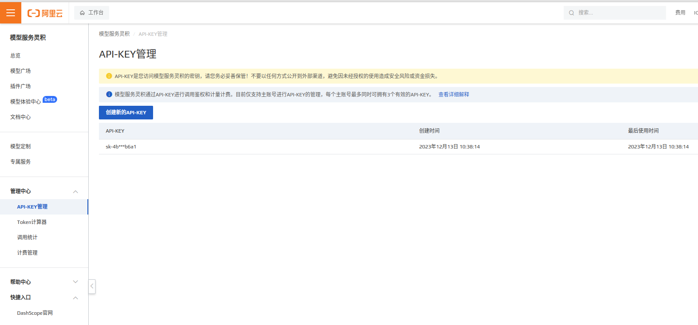

# QWen cli 使用手册

本文档描述了阿里云大模型 Qwen-72B 的共有云部署的 api 调用工具，供大家学习参考和使用

## why we need it instead of use it on browser directly

* oh feel free to do so because this project is for it geek [千问](https://tongyi.aliyun.com/)
* 回到正题，首先你不会因为浏览器登陆时间过长导致 session 过期要求你重新登陆
* 在页面上你无法调用参数，至少目前不行(this project does)
* 可以直接输出 json 供你进一部开发用
* 最重要的是 it's fun :)

## 我们需要准备什么

* 首先你要开通你的 api-key 请建一个阿里云账号，然后登陆进去搜索 `模型服务灵积` 然后 `实名认证` 最后在 `API-Key管理` 页面创建一个 api-key 并注意保存



* 一台 linux 或者 mac
* git 工具
* golang 1.21.4+
* make 包必须安装
* 一个 api-key 前面有介绍到

## get start

### download the project

```bash
# download it
# you know what to do
```

### build it

```bash
# build it
$ make go-build
```

### prepare config

```bash
# 创建一个隐藏目录
$ mkdir -p ~/.qwen-cli/conversation

# 配合 api 基本信息
# api_url--api 地址这里不用改
# api_key--api key 这里替换称你自己的 key 即可
$ cat > ~/.qwen-cli/conversation/api-config.json <<EOF
{
    "api_url": "https://dashscope.aliyuncs.com/api/v1/services/aigc/text-generation/generation",
    "api_key": "you-key"
}
EOF

# 配置 parameter 参数
$ cat > ~/.qwen-cli/conversation/parameter-config.json <<EOF
{
    "result_format": "text",
    "seed": 65535,
    "max_tokens": 1500,
    "top_p": 0.8,
    "top_k": 50,
    "repetition_penalty": 1.1,
    "temperature": 1
}
EOF
```

### go for it

```bash
# 最基本的例子
$ ./qwen-cli prompt create "你好"
# 输出
你好！很高兴见到你。你可以问我任何问题，我会尽力回答你的。

# 使用带有上下文的对话,这样 qwen 也能通过 api 看到对话的上下问
$ ./gwen-cli conversation create c1
$ ./qwen-cli prompt create -c c1 "你好"
# 输出
你好！很高兴见到你。你可以问我任何问题，我会尽力回答你的。

# 使用 parameter 来访问 api
# 你可以修改 ~/.qwen-cli/conversation/parameter-config.json 来调整
# 请参照 https://help.aliyun.com/zh/dashscope/developer-reference/api-details?spm=5176.28630291.0.0.5ef87eb5UNmxpe&disableWebsiteRedirect=true
$ ./qwen-cli prompt create -t -c c1 "你好"

# 使用 raw 的输出 -r
$ ./qwen-cli prompt create -t -r -c c1 "你好"
# 输出
{
  "output": {
    "text": "",
    "finish_reason": "",
    "choices": [
      {
        "finish_reason": "stop",
        "message": {
          "content": "你好！你有什么问题吗？我会尽力帮助你的。",
          "role": "assistant"
        }
      }
    ],
    "output_tokens": 0,
    "input_tokens": 0,
    "request_id": ""
  }
}

# 使用文件来描述问题
$ cat > /tmp/question <<EOF
你好
EOF

$ ./qwen-cli prompt create -c c1 -f /tmp/question

# 问题如果复杂点我们需要等待稍微长点时间让 api 有足够时间推理我们可以调整超时时间
# 比如下面的命令等待 60 秒,默认是 30 秒
$ ./qwen-cli prompt create -c c1 -w 60 -f /tmp/question
```

### conversation 管理

conversation 是用来发送给 qwen api 的上下文,这样 qwen 就能知道上下文关系，我们可以方便的管理每个 conversation

```bash
# 列出 conversation
$ ./qwen-cli conversation list

# 创建一个 conversation
$ ./qwen-cli conversation create c1

# 删除一个 conversation
$ ./qwen-cli conversation delete c1

# 查看一个 conversation 的详细
$ ./qwen-cli conversation show c1
```

## windows user

emm, sorry I'm not a big fan of windows so it may or may not working on windows but hey you got the source code, u no what 2 do :)

## have fun
